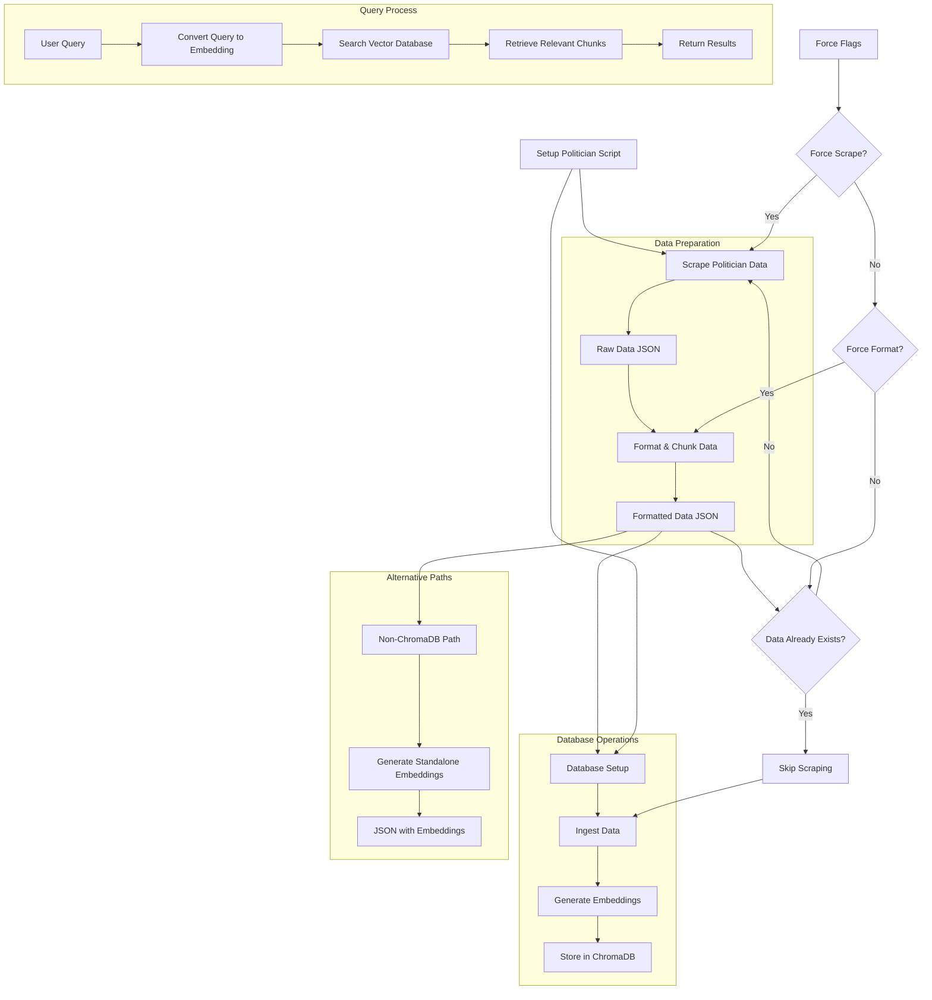

# AI Politician Data 🏛️

This repository contains tools for scraping, formatting, and querying data about politicians using vector embeddings and retrieval-augmented generation (RAG).

## 📂 Project Structure

- **scraper/**: Scripts for data collection
  - `politician_scraper.py`: Main scraper for politician data from Wikipedia, Ballotpedia, etc.
  - `search_utility.py`: Search utility without ChromaDB dependency

- **formatter/**: Data preparation tools
  - `data_formatter.py`: Converts raw data into structured format for RAG

- **scripts/**: Core functionality
  - `chroma_patched.py`: ChromaDB compatibility patch for NumPy 2.0
  - `chroma_config_patched.py`: ChromaDB configuration
  - `chroma_setup.py`: Database initialization
  - `ingest_data_patched.py`: Data ingestion pipeline
  - `query_data_patched.py`: Data retrieval interface
  - `diagnose_chroma.py`: Database diagnostic tool
  - `load_formatted_data.py`: Alternative data loader

- **data/**: Generated data directories
  - `politicians/`: Raw scraped data (JSON)
  - `formatted/`: Processed data optimized for RAG

> **Note**: The ChromaDB database is stored at `/opt/chroma_db` rather than in the project directory.

## 🚀 Getting Started

### Prerequisites

- Python 3.10+ 
- Conda (recommended) or virtualenv
- For Selenium scraping: Chrome/Chromium browser
- Sudo privileges to create the database directory (one-time only)

### 1️⃣ Clone the Repository

```bash
git clone https://github.com/yourusername/aipolitician-data.git
cd aipolitician-data
```

### 2️⃣ Database Setup

The system stores vector embeddings in ChromaDB at `/opt/chroma_db`. Set up the directory with:

```bash
# Create the database directory (requires sudo)
sudo mkdir -p /opt/chroma_db

# Set ownership to your user
sudo chown $USER:$USER /opt/chroma_db

# Set proper permissions
sudo chmod 755 /opt/chroma_db
```

### 3️⃣ Make Scripts Executable

```bash
chmod +x setup_politician.sh run_without_conda.sh
```

### 4️⃣ Run the Setup Script

#### Option A: With Conda (Recommended)

```bash
./setup_politician.sh "Politician Name"
```

For example:
```bash
./setup_politician.sh "Bernie Sanders"
```

The script will:
1. Create and activate a Conda environment (`aipolitician-chromadb`)
2. Install all dependencies 
3. Set up ChromaDB
4. Scrape data for the specified politician
5. Format the data for RAG
6. Load data into ChromaDB
7. Run a test query

#### Option B: Without Conda (Linux only)

```bash
./run_without_conda.sh "Politician Name"
```

### 5️⃣ Add Multiple Politicians

You can add multiple politicians to the database sequentially:

```bash
./setup_politician.sh "Joe Biden"
./setup_politician.sh "Donald Trump"
./setup_politician.sh "Kamala Harris"
```

Each politician's data is stored separately in the database and can be queried independently.

### 6️⃣ Query the Data

After setup, query the database with:

```bash
python scripts/query_data_patched.py --query "What is their position on healthcare?" --politician "Bernie Sanders" --results 3
```

## 📝 Example Commands

### Basic Query

```bash
python scripts/query_data_patched.py --query "climate change"
```

### Filtered Query

```bash
python scripts/query_data_patched.py --query "economy" --politician "Elizabeth Warren" --type "wikipedia_content"
```

### Detailed Response

```bash
python scripts/query_data_patched.py --query "foreign policy" --results 5
```

### Force Rescraping Data

```bash
./setup_politician.sh "Bernie Sanders" --force-scrape
```

### Force Reformatting Data

```bash
./setup_politician.sh "Bernie Sanders" --force-format
```

## ⚙️ Manual Setup (Advanced)

If you prefer to run each step manually:

1. **Install dependencies**:
   ```bash
   pip install -r requirements.txt
   
   # Download NLP models
   python -m spacy download en_core_web_sm
   python -c "import nltk; nltk.download('punkt'); nltk.download('stopwords')"
   ```

2. **Scrape data**:
   ```bash
   python scraper/politician_scraper.py "Politician Name"
   ```

3. **Format data**:
   ```bash
   python formatter/data_formatter.py --single data/politicians/politician_name.json
   ```

4. **Set up database**:
   ```bash
   python scripts/chroma_setup.py
   ```

5. **Ingest data**:
   ```bash
   python scripts/ingest_data_patched.py data/formatted/formatted_politician_name.json
   ```

6. **Query data**:
   ```bash
   python scripts/query_data_patched.py --query "Your question?" --politician "Politician Name"
   ```

## 🔍 Troubleshooting

### Database Permission Issues

If you see errors like:
```
Error: Could not create /opt/chroma_db. You may need sudo privileges.
```

Run these commands:
```bash
sudo mkdir -p /opt/chroma_db
sudo chown $USER:$USER /opt/chroma_db
sudo chmod 755 /opt/chroma_db
```

### Wrong Data Being Used

If you see references to the wrong politician:

```bash
# Run with both flags to force fresh data
./setup_politician.sh "Politician Name" --force-scrape --force-format
```

### SQLite Errors

If you encounter `sqlite3.OperationalError` with messages about missing columns or tables:

```bash
# Clean the database and start fresh
sudo rm -rf /opt/chroma_db/*
sudo chown $USER:$USER /opt/chroma_db
sudo chmod 755 /opt/chroma_db
```

### ChromaDB Compatibility

This project includes patches for ChromaDB to work with NumPy 2.0. If you have issues:

```bash
python scripts/diagnose_chroma.py
```

### Selenium WebDriver Errors

If the scraper fails with Selenium errors:
- Ensure Chrome or Chromium is installed
- For Linux users: `sudo apt install chromium-browser`

## 📃 Data Structure

The processed data is organized as follows:

- **Raw data**: `data/politicians/politician_name.json`
- **Formatted data**: `data/formatted/formatted_politician_name.json`
- **Vector database**: `/opt/chroma_db`

Each politician's data contains:
- Wikipedia content
- Ballotpedia information 
- Voting records (when available)
- Biographical information
- Social media details (when available)

## 🛠️ Advanced Features

### Alternative Data Loading (No ChromaDB)

```bash
python scripts/load_formatted_data.py data/formatted/*.json --output-dir data/embeddings
```

### Running on Remote Servers

For headless environments:
1. Install a headless browser: `sudo apt install chromium-browser`
2. Use the `--no-sandbox` flag (added automatically in the scripts)

## 📚 Additional Resources

- [ChromaDB Documentation](https://docs.trychroma.com/)
- [Selenium Documentation](https://selenium-python.readthedocs.io/)
- [SpaCy Documentation](https://spacy.io/usage) 

## 🔄 System Workflow

